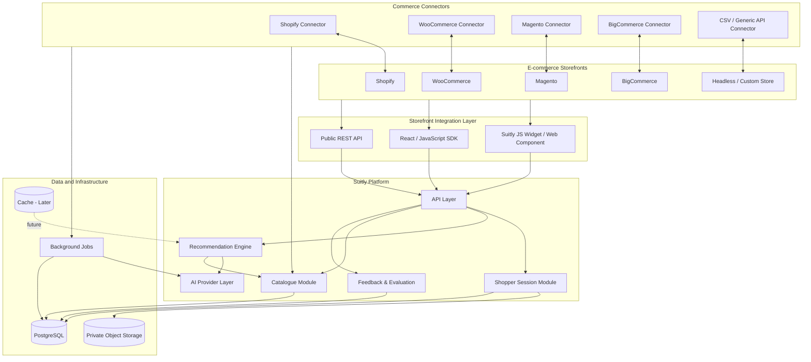
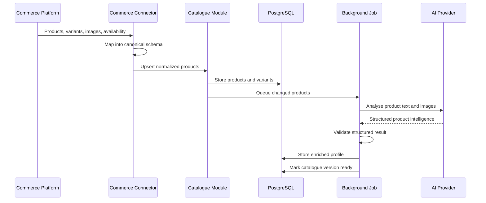
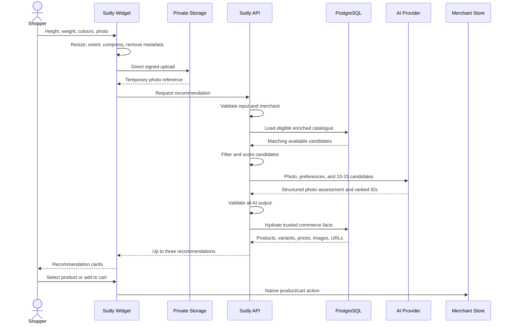
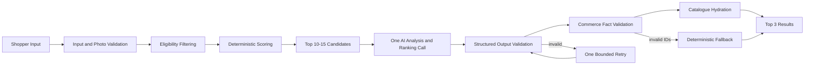
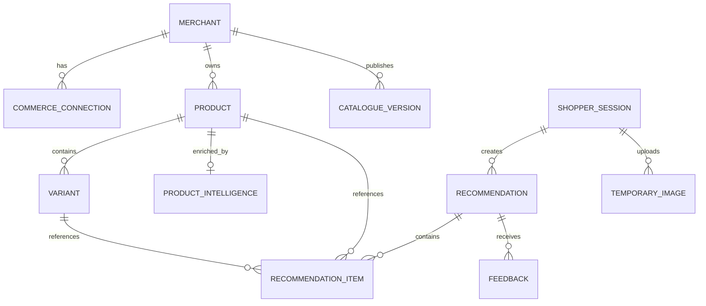
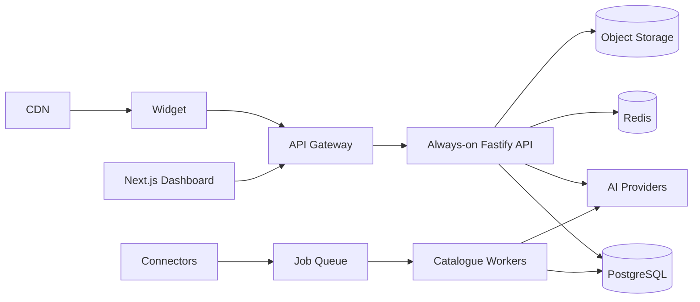

# Suitly System Architecture

**Status:** Accepted for MVP

**Date:** 2026-07-27

**Scope:** Platform-neutral AI fashion recommendation system

**Initial validation source:** Merchant catalogue supplied by CSV

**Initial commerce connector after validation:** Shopify

## 1. Product objective

Suitly is a commerce-platform-independent recommendation service. It accepts a
shopper's height, weight, colour preferences, and a clear full-body photograph,
then recommends up to three real, available fashion products from a merchant's
catalogue.

Shopify is the first planned live commerce connector, not the foundation of the
system. The same recommendation core must support WooCommerce, Adobe
Commerce/Magento, BigCommerce, headless commerce, and custom stores through
connectors and SDKs.

The MVP must answer:

> Does adding the shopper's photograph to height, weight, and stated
> preferences produce recommendations that are meaningfully better than
> ordinary catalogue filtering?

The system does not promise exact sizing from a single photograph. Style
confidence and size confidence are always separate. Size guidance is only
provided when the catalogue contains sufficient supporting evidence.

## 2. Architectural principles

1. Commerce platforms connect through adapters.
2. All external catalogue data is converted into one canonical Suitly schema.
3. Recommendation code never depends directly on Shopify or another platform.
4. PostgreSQL and validated catalogue data are the source of truth for commerce
   facts.
5. AI may analyse and rank, but it may not invent products, variants, prices,
   inventory, URLs, images, colours, or sizes.
6. Product intelligence is calculated asynchronously and cached.
7. The shopper-facing request uses one multimodal AI call where practical.
8. Raw shopper photographs are private, temporary, and deleted automatically.
9. Start as a modular monolith; split services only when measurements justify
   the added complexity.
10. Optimize recommendation accuracy first, then compare cheaper and faster
    models against a recorded evaluation set.

## 3. High-level architecture



## 4. Application and repository design

The MVP uses TypeScript throughout and begins with a Next.js application. Core
business logic belongs in framework-independent packages so the API can later
move to an always-on Fastify service without rewriting the recommendation
engine.

```text
suitly/
  apps/
    web/                  Next.js MVP, merchant UI, and demo shopper flow
    api/                  Public/internal API; may initially share deployment
    worker/               Catalogue sync and enrichment when needed

  packages/
    core/                 Canonical domain models
    catalogue/            Normalisation, queries, and catalogue rules
    recommendation/       Eligibility, scoring, validation, and hydration
    ai/                   Provider interfaces and implementations
    connector-sdk/        Commerce connector contract
    storefront-sdk/       Universal widget and client SDK
    database/             PostgreSQL schema and queries
    observability/        Logging, metrics, and tracing

  connectors/
    csv/
    shopify/
    woocommerce/
    magento/
    bigcommerce/
    custom-api/
```

This is a target logical structure. During early milestones, packages may live
inside one application as long as module boundaries remain clear.

## 5. Catalogue ingestion and enrichment

Catalogue work is asynchronous and never runs on the shopper request path.



Supported sources are introduced incrementally:

1. Generic CSV import
2. Shopify connector
3. WooCommerce connector
4. Headless/custom API connector and SDK
5. BigCommerce connector
6. Adobe Commerce/Magento connector

Each connector owns authentication, pagination, webhook verification, source
field mapping, rate-limit handling, and platform cart/product URLs. Everything
after normalization is platform independent.

## 6. Real-time recommendation request

The customer-facing path is deliberately short.



No live commerce-platform request is made while generating recommendations.
Webhooks and periodic reconciliation keep the local catalogue current.

## 7. Recommendation pipeline



### 7.1 Eligibility filtering

TypeScript code removes products that are:

- inactive or out of stock;
- owned by another merchant;
- in the wrong category;
- missing required identifiers or a usable image;
- unavailable in the requested colour;
- outside explicit price constraints; or
- too incomplete to support a credible recommendation.

### 7.2 Deterministic scoring

Store score components for debugging and evaluation:

- colour compatibility;
- fit and silhouette compatibility;
- height and garment-length compatibility;
- product-data confidence;
- size-data availability;
- optional merchant merchandising constraints.

The weights are hypotheses and must be changed through evaluation, not intuition
alone.

### 7.3 AI ranking

The AI receives a compact list of real candidate and variant IDs. Its strict
structured result may include:

- photo validity and specific image issues;
- fashion-relevant visible geometry;
- ranked supplied product and variant IDs;
- style score and style confidence;
- recommended size only when evidence allows it;
- size confidence;
- concise reasons and fit risk.

### 7.4 Validation and fallback

The backend verifies ownership, existence, variant membership, availability,
size, and colour. Title, price, currency, image, inventory, and URL are always
hydrated from the catalogue. Invalid AI selections are dropped. If necessary,
deterministic ranking fills the remaining result slots.

## 8. AI provider strategy

AI access is behind internal interfaces:

```ts
interface ProductIntelligenceProvider {
  enrichProduct(input: ProductIntelligenceInput): Promise<ProductIntelligence>;
}

interface RecommendationAIProvider {
  analyseAndRank(
    input: RecommendationAIInput,
  ): Promise<RecommendationAIResult>;
}
```

Initial model roles:

| Task | Initial model strategy |
|---|---|
| Product enrichment | Local Qwen 3.5 4B through Ollama, processed asynchronously and cached |
| Evaluation benchmark | Human-labelled evaluation set; cloud comparison only by explicit opt-in |
| Live photo analysis and ranking | Local Qwen candidate, subject to latency and quality benchmark |
| Ambiguous photo | Ask for a better photo rather than silently spending twice |
| Conversational refinement | Local model, after the first MVP |
| Embeddings | None until catalogue scale demonstrates a need |

Model identifiers, thresholds, schema versions, and prompt versions are
configuration. Do not hardcode them throughout application modules. Cloud AI
implementations remain available for controlled evaluation but are disabled by
default during the local-only MVP.

## 9. Canonical domain model

Primary entities:



Minimum canonical catalogue data:

- merchant and source platform;
- stable external product and variant IDs;
- title, description, category, handle, and product URL;
- product and variant images;
- colour, size, price, and currency;
- active and availability state;
- inventory information when supplied;
- size chart or garment measurements when supplied;
- source update time and catalogue version.

Raw shopper images are not stored in PostgreSQL.

## 10. Storefront integration

Suitly must work without requiring a merchant to use Next.js.

Supported delivery mechanisms:

- asynchronous script and web component;
- React/JavaScript SDK;
- platform-native wrappers such as a Shopify theme app extension;
- WooCommerce plugin, Magento module, or BigCommerce script integration;
- direct REST API for headless and custom applications.

The widget carries only a public merchant identifier and short-lived session
credentials. Commerce access tokens and AI provider keys remain server-side.

The widget must lazy-load after user interaction and must not block the
merchant's primary page rendering.

## 11. Privacy and security

Shopper photograph flow:

```text
browser resizing
  -> short-lived signed upload
  -> private object storage
  -> temporary AI access
  -> structured fashion profile
  -> automatic original-image deletion
```

Required controls:

- accept only JPEG, PNG, or WebP;
- verify actual file signatures, dimensions, and size;
- remove unnecessary metadata;
- use private storage and short-lived signed URLs;
- encrypt in transit and at rest;
- record the shopper's consent version;
- never expose a raw image through a public URL;
- never use shopper images for training without separate explicit consent;
- never infer identity or sensitive personal attributes;
- store fashion-relevant structured data only when needed;
- enforce automatic deletion, including failure paths.

## 12. Performance design

Target latency budget:

| Operation | Target |
|---|---:|
| Widget bootstrap | Under 300 ms |
| Cached merchant configuration | Under 200 ms |
| Browser image preparation | Under 500 ms |
| Upload on a reasonable connection | Under 1-2 seconds |
| Candidate filtering | Under 50 ms |
| AI processing | Target 2-5 seconds |
| Validation and hydration | Under 100 ms |
| Total after upload | Approximately 3-6 seconds |

Performance rules:

1. Precompute product intelligence.
2. Cache public merchant configuration and compact candidate representations.
3. Keep local availability synchronized through webhooks.
4. Do not call commerce platforms during recommendation generation.
5. Send only 10-15 candidates to the AI.
6. Use one shopper-facing AI call where evaluations support it.
7. Resize and compress photographs before upload.
8. Keep API, database, and object storage in nearby regions.
9. Use always-on production infrastructure; do not rely on sleeping free tiers.
10. Measure p50, p95, and p99 latency separately.

The UI shows immediate photo preview, progress stages, result skeletons, and
specific recoverable errors while work completes.

## 13. Technology decisions

### MVP

- TypeScript in strict mode
- Next.js and React
- Zod
- PostgreSQL
- Drizzle ORM
- Ollama-hosted local models behind provider interfaces
- Cloudflare R2 or equivalent private S3-compatible storage
- Sharp
- Vitest
- Playwright where end-to-end coverage is valuable
- Pino structured logging
- Sentry for initial error and latency monitoring

### Not included initially

- microservices;
- Kubernetes;
- a vector database;
- Redis unless measurements demonstrate a need;
- a separate queue cluster;
- MediaPipe;
- custom model training;
- virtual try-on;
- billing;
- public app-store submission;
- multiple clothing categories.

Free service tiers are suitable for development and the internal POC. Customer
production must use always-on compute and database resources to avoid cold starts
or inactivity pauses.

## 14. Failure behaviour

| Failure | Required behaviour |
|---|---|
| Invalid or unusable photo | Request a better photo and explain the issue |
| AI timeout | Bounded retry or deterministic fallback |
| Invalid structured output | One bounded corrected retry |
| Unknown product/variant ID | Reject it |
| Unavailable variant | Drop it and use the next candidate |
| Fewer than three valid results | Fill from deterministic ranking |
| Missed commerce webhook | Periodic catalogue reconciliation |
| Object storage failure | Preserve form state and allow upload retry |
| No exact colour match | Explain and optionally offer alternatives |
| Insufficient size evidence | Recommend style but withhold confident sizing |

## 15. Evaluation and release gates

At minimum compare:

1. colour and availability filtering;
2. height, weight, colour, and stated preference;
3. height, weight, colour, stated preference, and photograph.

Track:

- top-one and top-three suitability;
- recommendation diversity;
- multiple-reviewer agreement;
- photo rejection accuracy;
- style and size-confidence calibration;
- invalid ID and unavailable-variant rate;
- schema failure rate;
- p50/p95/p99 latency;
- AI cost per successful recommendation;
- click, would-buy, and explicit feedback;
- whether the photograph adds measurable value.

Shopify OAuth, live sync, and storefront integration begin only after the
catalogue and recommendation-quality gates are credible.

## 16. Delivery sequence

1. Inspect the real CSV and produce a mapping/data-quality report.
2. Define and test the canonical product and variant schemas.
3. Normalize the catalogue.
4. Enrich 20-50 products asynchronously.
5. Build the internal shopper flow and temporary photo handling.
6. Implement filtering, one-call AI ranking, validation, and fallback.
7. Build feedback and evaluation tooling.
8. Compare the photograph-assisted system with simpler baselines.
9. Implement the universal widget and public API contract.
10. Add Shopify as the first live commerce connector.

## 17. Future evolution

When production evidence requires it:



Extract the API when serverless limits or latency justify it. Add workers when
catalogue operations affect request reliability. Add Redis, vector search,
MediaPipe, or multiple AI providers only after evaluation or operational
measurements demonstrate their value.
